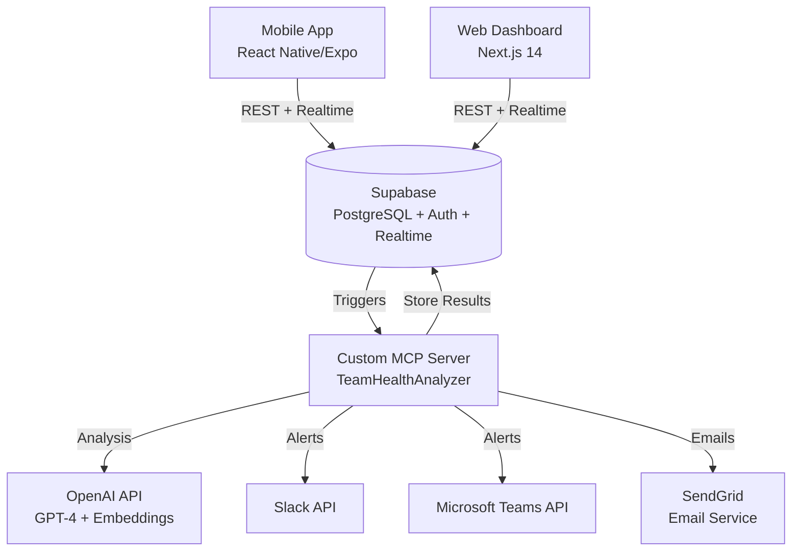

# Design Document

## Overview

Pulse is a full-stack team health monitoring platform built with a mobile-first architecture. The system consists of three main components:

1. **Mobile App** (React Native/Expo) - Full-featured interface for both team members and managers. Team members can submit check-ins and view team pulse. Managers can additionally view team health, alerts, and generate 1-on-1 prep.
2. **Web Dashboard** (Next.js 14) - Full-featured interface for both team members and managers with the same capabilities as mobile. Optimized for desktop viewing with enhanced data visualization.
3. **Backend Services** (Supabase + Custom MCP Server) - Data storage, real-time updates, and AI analysis

The architecture prioritizes real-time updates, data privacy, and seamless integration between mobile and web experiences. Both platforms have full feature parity, with UI optimizations for each form factor.

## Architecture

### High-Level Architecture



### Technology Stack

**Frontend:**

- Mobile: React Native (Expo SDK 50+), React Navigation, React Query, Zustand
- Web: Next.js 14 (App Router), React Query, Tailwind CSS, Recharts

**Backend:**

- Database: Supabase (PostgreSQL 15+)
- Auth: Supabase Auth (JWT-based)
- Real-time: Supabase Realtime (WebSocket)
- Storage: Supabase Storage (for exports/reports)

**AI/Analysis:**

- Custom MCP Server: Node.js + TypeScript
- LLM: OpenAI GPT-4 Turbo
- Embeddings: OpenAI text-embedding-3-small

**Integrations:**

- Slack: Bolt SDK for Node.js
- Microsoft Teams: Bot Framework SDK + Microsoft Graph API
- Email: SendGrid API
- Push Notifications: Expo Push Notifications

### Deployment Architecture

**Mobile:**

- iOS: App Store (TestFlight for beta)
- Android: Google Play Store
- OTA Updates: Expo EAS Update

**Web:**

- Hosting: Vercel (Edge Functions)
- CDN: Vercel Edge Network
- Domain: Custom domain with SSL

**Backend:**

- Supabase: Hosted (supabase.com)
- MCP Server: Deployed as serverless functions or containerized service
- Scheduled Jobs: Supabase Edge Functions with pg_cron

## Components and Interfaces

### Mobile App Components

#### 1. Check-In Flow (Team Members)

**Purpose:** Guide team members through daily check-in submission

**Screens:**

1. Workload Screen - 3 large buttons (manageable/challenging/overwhelming)
2. Clarity Screen - 3 large buttons (clear/somewhat clear/confused)
3. Focus Screen - Text input with quick picks
4. Blockers Screen - Text input with "Nothing blocking me" option
5. Celebration Screen - Streak display + team pulse preview

**State Management:**

- Local state: Zustand store for check-in draft
- Persistence: AsyncStorage for offline support
- Submission: React Query mutation with optimistic updates

**Navigation:**

```typescript
type CheckInStackParamList = {
  Workload: undefined;
  Clarity: undefined;
  Focus: undefined;
  Blockers: undefined;
  Celebration: { checkInId: string };
};
```

#### 2. Team Pulse Visualization (All Users)

**Purpose:** Show real-time team health status

**Components:**

- CompletionRing: Circular progress showing check-in completion %
- WorkloadIndicator: Color-coded average workload
- TrendChart: 7-day mini sparkline
- AnimatedTransition: Smooth updates when new check-ins arrive

**Real-time Updates:**

- Subscribe to Supabase Realtime channel: `team:{teamId}:pulse`
- Update local state on INSERT events
- Animate transitions with React Native Reanimated

#### 3. Manager Dashboard (Managers Only)

**Purpose:** Mobile-optimized manager interface

**Tabs:**

- Team Tab: Scrollable list of team members with health scores
- Alerts Tab: Active burnout alerts with swipe actions
- Insights Tab: AI-generated insights cards

**Features:**

- Pull-to-refresh for latest data
- Tap member → View detail sheet
- Tap alert → View details + recommended actions
- Generate 1-on-1 prep → Bottom sheet with talking points

**Navigation:**

```typescript
type ManagerStackParamList = {
  TeamList: undefined;
  MemberDetail: { memberId: string };
  AlertDetail: { alertId: string };
  OneOnOnePrep: { memberId: string };
};
```

#### 4. Profile & Settings (All Users)

**Purpose:** Manage user preferences and view personal stats

**Features:**

- Streak display (current + longest)
- Check-in time preference
- Notification settings
- Theme preference (light/dark)
- Account management
- Role badge (Member/Manager/Admin)

### Web Dashboard Components

**Note:** All users can access the web dashboard. Team members can submit check-ins, view their history, and see team pulse. Managers see additional tabs for team health, alerts, and insights.

#### 1. Check-In Flow (Team Members)

**Purpose:** Web-based check-in submission (alternative to mobile)

**Layout:**

- Single-page form with all fields visible
- Progress indicator at top
- Large, clickable buttons for workload and clarity
- Text areas for focus and blockers
- Submit button at bottom

**Features:**

- Auto-save draft to localStorage
- Keyboard shortcuts (Tab navigation, Enter to submit)
- Quick picks for common responses
- Real-time character count
- Celebration modal on submission

**Implementation:**

```typescript
// Next.js page component
export default function CheckInPage() {
  const [draft, setDraft] = useLocalStorage('checkin-draft', {});
  const { mutate: submitCheckIn } = useMutation({
    mutationFn: async (data) => {
      return await supabase.from('check_ins').insert(data);
    },
    onSuccess: () => {
      showCelebrationModal();
      clearDraft();
    },
  });

  return (
    <form onSubmit={handleSubmit}>
      <WorkloadSelector value={draft.workload} onChange={...} />
      <ClaritySelector value={draft.clarity} onChange={...} />
      <FocusInput value={draft.focus} onChange={...} />
      <BlockerInput value={draft.blocker} onChange={...} />
      <SubmitButton />
    </form>
  );
}
```

#### 2. Team Health Overview (All Users)

**Purpose:** High-level team health metrics

**Sections:**

- Team Health Score: 0-100 calculated from recent 30 days
- Active Alerts: Count of unresolved burnout signals
- Check-in Rate: Today's completion percentage
- Trend Chart: 30-day health score history

**Data Fetching:**

```typescript
// React Query hook
const { data: teamHealth } = useQuery({
  queryKey: ["team-health", teamId],
  queryFn: () => supabase.rpc("calculate_team_health", { team_id: teamId }),
  refetchInterval: 30000, // Refresh every 30s
});
```

#### 3. Check-In History (Team Members)

**Purpose:** View personal check-in history and trends

**Features:**

- Calendar view of past check-ins
- Streak visualization
- Personal health score trend
- Filter by date range

#### 4. Team Members List (Managers Only)

**Purpose:** Individual health scores and quick access to member details

**Table Columns:**

- Name + Avatar
- Health Score (0-100)
- Trend Indicator (↑ improving, → stable, ↓ declining)
- Last Check-in (relative time)
- Active Signals (badge count)

**Interactions:**

- Click row → Navigate to member detail page
- Hover → Show quick preview tooltip
- Sort by any column
- Filter by health score range

#### 5. Insights Tab (Managers Only)

**Purpose:** AI-generated insights and recommendations

**Card Types:**

- Persistent Blocker Alert: Team member, blocker text, mention count, severity
- Workload Alert: Team member, overwhelming count, trend
- Disengagement Alert: Team member, previous rate, current rate
- Positive Pattern: Team achievements, streaks, improvements

**AI Generation:**

- Fetch insights from MCP server via Supabase RPC
- Display confidence level (60-100%)
- Show recommended actions
- Allow manager to dismiss with feedback

#### 6. 1-on-1 Prep Tool (Managers Only)

**Purpose:** Generate talking points for manager-member conversations

**Input:**

- Select team member
- Select date range (default: last 14 days)

**Output:**

- Summary of recent check-ins
- Identified patterns (positive + concerning)
- Suggested talking points (3-5 bullets)
- Relevant blocker history

**Implementation:**

```typescript
const generate1on1Prep = async (memberId: string, dateRange: DateRange) => {
  const { data } = await supabase.rpc("generate_1on1_prep", {
    member_id: memberId,
    start_date: dateRange.start,
    end_date: dateRange.end,
  });
  return data; // Generated by MCP server
};
```

#### 7. Team Progress Reports (Managers Only)

**Purpose:** Generate weekly and monthly progress reports for different audiences

**Report Types:**

1. **Weekly Technical Report**

   - Tasks completed this week
   - Blockers encountered and resolved
   - Team velocity (check-ins per day, completion rate)
   - Active technical debt items
   - Code quality metrics (if integrated)

2. **Monthly Technical Report**

   - Detailed task breakdown by category
   - Technical achievements and challenges
   - Team health trends over the month
   - Burnout signals detected and resolved
   - Technical debt added vs. resolved

3. **Monthly Business Report**
   - Features delivered (in plain language)
   - Story points completed
   - Team health score trend
   - Key achievements and milestones
   - Risks and concerns (high-level)
   - Recommendations for next month

**Interface:**

```typescript
// Report generation component
export default function ReportsPage() {
  const [reportType, setReportType] = useState<
    "weekly-tech" | "monthly-tech" | "monthly-business"
  >("weekly-tech");
  const [dateRange, setDateRange] = useState<DateRange>(
    getDefaultRange(reportType)
  );

  const { mutate: generateReport, isLoading } = useMutation({
    mutationFn: async () => {
      return await supabase.rpc("generate_team_report", {
        team_id: teamId,
        report_type: reportType,
        start_date: dateRange.start,
        end_date: dateRange.end,
      });
    },
    onSuccess: (data) => {
      displayReport(data);
    },
  });

  return (
    <div>
      <ReportTypeSelector value={reportType} onChange={setReportType} />
      <DateRangePicker value={dateRange} onChange={setDateRange} />
      <GenerateButton onClick={generateReport} loading={isLoading} />
      <ReportPreview report={report} />
      <ExportButtons formats={["pdf", "markdown"]} />
    </div>
  );
}
```

**Scheduled Reports:**

- Weekly technical reports: Auto-generated every Friday at 5pm
- Monthly reports: Auto-generated on last day of month
- Delivered via email and Slack DM to managers
- Stored in Supabase Storage for historical access

### Backend Components

#### 1. Supabase Database Schema

**Tables:**

```sql
-- Users and Teams
CREATE TABLE profiles (
  id UUID PRIMARY KEY REFERENCES auth.users(id),
  email TEXT NOT NULL,
  full_name TEXT,
  avatar_url TEXT,
  role TEXT CHECK (role IN ('member', 'manager', 'admin')),
  team_id UUID REFERENCES teams(id),
  created_at TIMESTAMPTZ DEFAULT NOW()
);

CREATE TABLE teams (
  id UUID PRIMARY KEY DEFAULT gen_random_uuid(),
  name TEXT NOT NULL,
  slug TEXT UNIQUE NOT NULL,
  created_at TIMESTAMPTZ DEFAULT NOW()
);

-- Check-ins
CREATE TABLE check_ins (
  id UUID PRIMARY KEY DEFAULT gen_random_uuid(),
  user_id UUID REFERENCES profiles(id) NOT NULL,
  team_id UUID REFERENCES teams(id) NOT NULL,
  workload TEXT CHECK (workload IN ('manageable', 'challenging', 'overwhelming')),
  clarity TEXT CHECK (clarity IN ('clear', 'somewhat_clear', 'confused')),
  focus_text TEXT,
  blocker_text TEXT,
  support_text TEXT,
  submitted_at TIMESTAMPTZ DEFAULT NOW(),
  created_at TIMESTAMPTZ DEFAULT NOW()
);

-- Streaks
CREATE TABLE streaks (
  id UUID PRIMARY KEY DEFAULT gen_random_uuid(),
  user_id UUID REFERENCES profiles(id) NOT NULL,
  current_streak INTEGER DEFAULT 0,
  longest_streak INTEGER DEFAULT 0,
  last_check_in_date DATE,
  updated_at TIMESTAMPTZ DEFAULT NOW()
);

-- Blockers (for AI analysis)
CREATE TABLE blockers (
  id UUID PRIMARY KEY DEFAULT gen_random_uuid(),
  check_in_id UUID REFERENCES check_ins(id) NOT NULL,
  user_id UUID REFERENCES profiles(id) NOT NULL,
  team_id UUID REFERENCES teams(id) NOT NULL,
  blocker_text TEXT NOT NULL,
  embedding VECTOR(1536), -- OpenAI embedding
  is_resolved BOOLEAN DEFAULT FALSE,
  resolved_at TIMESTAMPTZ,
  created_at TIMESTAMPTZ DEFAULT NOW()
);

-- Burnout Signals
CREATE TABLE burnout_signals (
  id UUID PRIMARY KEY DEFAULT gen_random_uuid(),
  user_id UUID REFERENCES profiles(id) NOT NULL,
  team_id UUID REFERENCES teams(id) NOT NULL,
  signal_type TEXT CHECK (signal_type IN ('persistent_blocker', 'overwhelming_workload', 'disengagement')),
  severity TEXT CHECK (severity IN ('low', 'medium', 'high')),
  confidence DECIMAL(3,2), -- 0.00 to 1.00
  metadata JSONB, -- Signal-specific data
  detected_at TIMESTAMPTZ DEFAULT NOW()
);

-- Manager Alerts
CREATE TABLE manager_alerts (
  id UUID PRIMARY KEY DEFAULT gen_random_uuid(),
  manager_id UUID REFERENCES profiles(id) NOT NULL,
  team_member_id UUID REFERENCES profiles(id) NOT NULL,
  team_id UUID REFERENCES teams(id) NOT NULL,
  priority TEXT CHECK (priority IN ('low', 'medium', 'high')),
  title TEXT NOT NULL,
  description TEXT NOT NULL,
  recommended_actions JSONB,
  signals UUID[] REFERENCES burnout_signals(id),
  is_dismissed BOOLEAN DEFAULT FALSE,
  dismissed_reason TEXT,
  created_at TIMESTAMPTZ DEFAULT NOW()
);

-- Slack Integration
CREATE TABLE slack_workspaces (
  id UUID PRIMARY KEY DEFAULT gen_random_uuid(),
  team_id UUID REFERENCES teams(id) NOT NULL,
  workspace_id TEXT NOT NULL,
  access_token TEXT NOT NULL, -- Encrypted
  bot_user_id TEXT,
  channel_id TEXT, -- Team channel for summaries
  created_at TIMESTAMPTZ DEFAULT NOW()
);

-- Microsoft Teams Integration
CREATE TABLE teams_workspaces (
  id UUID PRIMARY KEY DEFAULT gen_random_uuid(),
  team_id UUID REFERENCES teams(id) NOT NULL,
  tenant_id TEXT NOT NULL,
  service_url TEXT NOT NULL,
  access_token TEXT NOT NULL, -- Encrypted
  refresh_token TEXT NOT NULL, -- Encrypted
  bot_id TEXT,
  team_channel_id TEXT, -- Team channel for summaries
  expires_at TIMESTAMPTZ,
  created_at TIMESTAMPTZ DEFAULT NOW()
);

-- Integration Preferences (which platform to use)
CREATE TABLE integration_preferences (
  id UUID PRIMARY KEY DEFAULT gen_random_uuid(),
  team_id UUID REFERENCES teams(id) NOT NULL,
  preferred_platform TEXT CHECK (preferred_platform IN ('slack', 'teams', 'both')),
  created_at TIMESTAMPTZ DEFAULT NOW(),
  UNIQUE(team_id)
);

-- Team Reports
CREATE TABLE team_reports (
  id UUID PRIMARY KEY DEFAULT gen_random_uuid(),
  team_id UUID REFERENCES teams(id) NOT NULL,
  report_type TEXT CHECK (report_type IN ('weekly_technical', 'monthly_technical', 'monthly_business')),
  start_date DATE NOT NULL,
  end_date DATE NOT NULL,
  content JSONB NOT NULL, -- Report data structure
  generated_by UUID REFERENCES profiles(id),
  is_scheduled BOOLEAN DEFAULT FALSE,
  created_at TIMESTAMPTZ DEFAULT NOW()
);

-- Tasks (for tracking work items)
CREATE TABLE tasks (
  id UUID PRIMARY KEY DEFAULT gen_random_uuid(),
  team_id UUID REFERENCES teams(id) NOT NULL,
  assigned_to UUID REFERENCES profiles(id),
  title TEXT NOT NULL,
  description TEXT,
  status TEXT CHECK (status IN ('todo', 'in_progress', 'done', 'blocked')),
  story_points INTEGER,
  category TEXT, -- 'feature', 'bug', 'technical_debt', etc.
  completed_at TIMESTAMPTZ,
  created_at TIMESTAMPTZ DEFAULT NOW()
);
```

**Indexes:**

```sql
CREATE INDEX idx_check_ins_user_date ON check_ins(user_id, submitted_at DESC);
CREATE INDEX idx_check_ins_team_date ON check_ins(team_id, submitted_at DESC);
CREATE INDEX idx_blockers_user ON blockers(user_id, created_at DESC);
CREATE INDEX idx_burnout_signals_user ON burnout_signals(user_id, detected_at DESC);
CREATE INDEX idx_manager_alerts_manager ON manager_alerts(manager_id, created_at DESC) WHERE NOT is_dismissed;
```

**Row Level Security (RLS):**

```sql
-- Profiles: Users can read their own and team members'
ALTER TABLE profiles ENABLE ROW LEVEL SECURITY;
CREATE POLICY "Users can view team members" ON profiles
  FOR SELECT USING (
    team_id IN (SELECT team_id FROM profiles WHERE id = auth.uid())
  );

-- Check-ins: Users can insert their own, managers can view team's
ALTER TABLE check_ins ENABLE ROW LEVEL SECURITY;
CREATE POLICY "Users can insert own check-ins" ON check_ins
  FOR INSERT WITH CHECK (user_id = auth.uid());
CREATE POLICY "Users can view team check-ins" ON check_ins
  FOR SELECT USING (
    team_id IN (SELECT team_id FROM profiles WHERE id = auth.uid())
  );

-- Manager Alerts: Only managers can view
ALTER TABLE manager_alerts ENABLE ROW LEVEL SECURITY;
CREATE POLICY "Managers can view their alerts" ON manager_alerts
  FOR SELECT USING (
    manager_id = auth.uid() AND
    EXISTS (SELECT 1 FROM profiles WHERE id = auth.uid() AND role IN ('manager', 'admin'))
  );
```

#### 2. Custom MCP Server (TeamHealthAnalyzer)

**Purpose:** AI-powered burnout detection and insight generation

**Tools:**

```typescript
// Tool 1: Detect Persistent Blockers
{
  name: "detectPersistentBlockers",
  description: "Analyze blocker history to identify persistent blockers using semantic similarity",
  inputSchema: {
    type: "object",
    properties: {
      userId: { type: "string" },
      lookbackDays: { type: "number", default: 30 }
    }
  }
}

// Tool 2: Analyze Burnout Risk
{
  name: "analyzeBurnoutRisk",
  description: "Multi-signal analysis to calculate burnout risk score",
  inputSchema: {
    type: "object",
    properties: {
      userId: { type: "string" },
      signals: { type: "array", items: { type: "string" } }
    }
  }
}

// Tool 3: Generate Manager Alert
{
  name: "generateManagerAlert",
  description: "Create actionable alert with recommended actions",
  inputSchema: {
    type: "object",
    properties: {
      userId: { type: "string" },
      signals: { type: "array" },
      context: { type: "object" }
    }
  }
}

// Tool 4: Generate 1-on-1 Prep
{
  name: "generate1on1Prep",
  description: "Create talking points for manager-member conversation",
  inputSchema: {
    type: "object",
    properties: {
      userId: { type: "string" },
      dateRange: { type: "object" }
    }
  }
}

// Tool 5: Generate Team Report
{
  name: "generateTeamReport",
  description: "Generate weekly or monthly team progress report for technical or business audience",
  inputSchema: {
    type: "object",
    properties: {
      teamId: { type: "string" },
      reportType: {
        type: "string",
        enum: ["weekly_technical", "monthly_technical", "monthly_business"]
      },
      startDate: { type: "string" },
      endDate: { type: "string" }
    }
  }
}
```

**Implementation Architecture:**

```typescript
// MCP Server Structure
src / index.ts; // MCP server entry point
tools / detectBlockers.ts; // Persistent blocker detection
analyzeBurnout.ts; // Multi-signal analysis
generateAlert.ts; // Alert generation
generate1on1.ts; // 1-on-1 prep
generateReport.ts; // Team progress reports
services / openai.ts; // OpenAI API client
supabase.ts; // Supabase client
similarity.ts; // Cosine similarity calculations
utils / prompts.ts; // LLM prompt templates
scoring.ts; // Health score calculations
reportFormatters.ts; // Report formatting utilities
```

**Key Algorithms:**

1. **Persistent Blocker Detection:**

```typescript
async function detectPersistentBlockers(userId: string, lookbackDays: number) {
  // 1. Fetch all blockers for user in lookback period
  const blockers = await fetchBlockers(userId, lookbackDays);

  // 2. Generate embeddings for new blockers (if not exists)
  for (const blocker of blockers) {
    if (!blocker.embedding) {
      blocker.embedding = await generateEmbedding(blocker.blocker_text);
      await saveEmbedding(blocker.id, blocker.embedding);
    }
  }

  // 3. Group similar blockers using cosine similarity
  const groups = [];
  for (const blocker of blockers) {
    let foundGroup = false;
    for (const group of groups) {
      const similarity = cosineSimilarity(
        blocker.embedding,
        group[0].embedding
      );
      if (similarity > 0.75) {
        group.push(blocker);
        foundGroup = true;
        break;
      }
    }
    if (!foundGroup) {
      groups.push([blocker]);
    }
  }

  // 4. Identify persistent blockers (3+ mentions over 14+ days)
  const persistentBlockers = groups.filter((group) => {
    const daySpan = calculateDaySpan(group);
    return group.length >= 3 && daySpan >= 14;
  });

  // 5. Calculate severity
  return persistentBlockers.map((group) => ({
    blockerText: group[group.length - 1].blocker_text, // Most recent
    mentionCount: group.length,
    daySpan: calculateDaySpan(group),
    severity: group.length >= 5 ? "high" : "medium",
    firstMention: group[0].created_at,
    lastMention: group[group.length - 1].created_at,
  }));
}
```

2. **Burnout Risk Analysis:**

```typescript
async function analyzeBurnoutRisk(userId: string) {
  // Collect all signals
  const signals = {
    persistentBlockers: await detectPersistentBlockers(userId, 30),
    overwhelmingWorkload: await countOverwhelmingWorkload(userId, 30),
    disengagement: await calculateDisengagement(userId, 14),
    lateNightCheckins: await countLateNightCheckins(userId, 30),
    clarityIssues: await countClarityIssues(userId, 30),
  };

  // Calculate weighted risk score
  let riskScore = 0;
  let confidence = 0;

  // Persistent blockers (highest weight)
  if (signals.persistentBlockers.length > 0) {
    riskScore += signals.persistentBlockers.length * 30;
    confidence += 0.9;
  }

  // Overwhelming workload
  if (signals.overwhelmingWorkload >= 5) {
    riskScore += 25;
    confidence += 0.8;
  }

  // Disengagement
  if (signals.disengagement.isDisengaged) {
    riskScore += 20;
    confidence += 0.7;
  }

  // Normalize score to 0-100
  riskScore = Math.min(riskScore, 100);
  confidence = confidence / 3; // Average confidence

  return {
    riskScore,
    confidence,
    signals,
    shouldAlert: riskScore >= 50 && confidence >= 0.6,
  };
}
```

#### 3. Supabase Edge Functions

**Function 1: Daily Check-in Reminders**

```typescript
// functions/send-checkin-reminders/index.ts
Deno.serve(async (req) => {
  // 1. Get all users with check-in time = current hour
  const users = await supabase
    .from("profiles")
    .select("id, email, full_name, check_in_time")
    .eq("check_in_time", getCurrentHour());

  // 2. Check if they already checked in today
  const usersToRemind = await filterAlreadyCheckedIn(users);

  // 3. Send Slack DM + Push notification
  for (const user of usersToRemind) {
    await sendSlackReminder(user);
    await sendPushNotification(user);
  }

  return new Response(JSON.stringify({ reminded: usersToRemind.length }));
});
```

**Function 2: Analyze Check-ins (Triggered on INSERT)**

```typescript
// functions/analyze-checkin/index.ts
Deno.serve(async (req) => {
  const checkIn = await req.json();

  // 1. Update streak
  await updateStreak(checkIn.user_id);

  // 2. If blocker mentioned, store and analyze
  if (checkIn.blocker_text && checkIn.blocker_text !== "Nothing blocking me") {
    await storeBlocker(checkIn);
    const persistentBlockers = await detectPersistentBlockers(
      checkIn.user_id,
      30
    );

    if (persistentBlockers.length > 0) {
      await createBurnoutSignal(
        checkIn.user_id,
        "persistent_blocker",
        persistentBlockers
      );
    }
  }

  // 3. Check for overwhelming workload pattern
  if (checkIn.workload === "overwhelming") {
    const count = await countOverwhelmingWorkload(checkIn.user_id, 30);
    if (count >= 5) {
      await createBurnoutSignal(checkIn.user_id, "overwhelming_workload", {
        count,
      });
    }
  }

  // 4. Update team pulse (real-time broadcast)
  await broadcastTeamPulse(checkIn.team_id);

  return new Response(JSON.stringify({ success: true }));
});
```

**Function 3: Generate Manager Alerts (Scheduled daily at 9am)**

```typescript
// functions/generate-alerts/index.ts
Deno.serve(async (req) => {
  // 1. Get all teams
  const teams = await supabase.from("teams").select("id");

  for (const team of teams) {
    // 2. Get all team members
    const members = await supabase
      .from("profiles")
      .select("id")
      .eq("team_id", team.id)
      .eq("role", "member");

    for (const member of members) {
      // 3. Analyze burnout risk
      const analysis = await analyzeBurnoutRisk(member.id);

      // 4. If should alert, generate and send
      if (analysis.shouldAlert) {
        const alert = await generateManagerAlert(member.id, analysis);
        await createAlert(alert);

        if (alert.priority === "high") {
          await sendSlackAlert(alert);
        }
      }
    }
  }

  return new Response(JSON.stringify({ success: true }));
});
```

## Data Models

### TypeScript Interfaces

```typescript
// User & Team
interface Profile {
  id: string;
  email: string;
  fullName: string;
  avatarUrl?: string;
  role: "member" | "manager" | "admin";
  teamId: string;
  checkInTime?: string; // HH:mm format
  notificationsEnabled: boolean;
  createdAt: string;
}

interface Team {
  id: string;
  name: string;
  slug: string;
  createdAt: string;
}

// Check-in
interface CheckIn {
  id: string;
  userId: string;
  teamId: string;
  workload: "manageable" | "challenging" | "overwhelming";
  clarity: "clear" | "somewhat_clear" | "confused";
  focusText?: string;
  blockerText?: string;
  supportText?: string;
  submittedAt: string;
  createdAt: string;
}

// Blocker
interface Blocker {
  id: string;
  checkInId: string;
  userId: string;
  teamId: string;
  blockerText: string;
  embedding?: number[]; // 1536-dimensional vector
  isResolved: boolean;
  resolvedAt?: string;
  createdAt: string;
}

// Burnout Signal
interface BurnoutSignal {
  id: string;
  userId: string;
  teamId: string;
  signalType: "persistent_blocker" | "overwhelming_workload" | "disengagement";
  severity: "low" | "medium" | "high";
  confidence: number; // 0.00 to 1.00
  metadata: {
    // Signal-specific data
    blockerText?: string;
    mentionCount?: number;
    daySpan?: number;
    overwhelmingCount?: number;
    previousRate?: number;
    currentRate?: number;
  };
  detectedAt: string;
}

// Manager Alert
interface ManagerAlert {
  id: string;
  managerId: string;
  teamMemberId: string;
  teamId: string;
  priority: "low" | "medium" | "high";
  title: string;
  description: string;
  recommendedActions: string[];
  signals: string[]; // Signal IDs
  isDismissed: boolean;
  dismissedReason?: string;
  createdAt: string;
}

// Team Health
interface TeamHealth {
  teamId: string;
  healthScore: number; // 0-100
  checkInRate: number; // 0-100
  activeAlerts: number;
  trendDirection: "up" | "stable" | "down";
  calculatedAt: string;
}

// 1-on-1 Prep
interface OneOnOnePrep {
  memberId: string;
  memberName: string;
  dateRange: { start: string; end: string };
  summary: string;
  patterns: {
    positive: string[];
    concerning: string[];
  };
  talkingPoints: string[];
  blockerHistory: {
    text: string;
    mentionCount: number;
    isResolved: boolean;
  }[];
  generatedAt: string;
}

// Team Report
interface TeamReport {
  id: string;
  teamId: string;
  reportType: "weekly_technical" | "monthly_technical" | "monthly_business";
  startDate: string;
  endDate: string;
  content:
    | WeeklyTechnicalReport
    | MonthlyTechnicalReport
    | MonthlyBusinessReport;
  generatedBy?: string;
  isScheduled: boolean;
  createdAt: string;
}

// Weekly Technical Report Content
interface WeeklyTechnicalReport {
  summary: string;
  tasksCompleted: {
    id: string;
    title: string;
    category: string;
    completedBy: string;
    completedAt: string;
  }[];
  blockersEncountered: {
    blocker: string;
    affectedMembers: string[];
    status: "active" | "resolved";
    resolvedAt?: string;
  }[];
  teamVelocity: {
    checkInsPerDay: number;
    completionRate: number;
    averageWorkload: string;
  };
  activeTechnicalDebt: {
    item: string;
    priority: string;
  }[];
}

// Monthly Technical Report Content
interface MonthlyTechnicalReport {
  summary: string;
  taskBreakdown: {
    features: number;
    bugs: number;
    technicalDebt: number;
    other: number;
  };
  technicalAchievements: string[];
  technicalChallenges: string[];
  teamHealthTrend: {
    startScore: number;
    endScore: number;
    direction: "improving" | "stable" | "declining";
  };
  burnoutSignals: {
    detected: number;
    resolved: number;
    active: number;
  };
  technicalDebt: {
    added: number;
    resolved: number;
    net: number;
  };
}

// Monthly Business Report Content
interface MonthlyBusinessReport {
  executiveSummary: string;
  featuresDelivered: {
    name: string;
    description: string;
    impact: string;
  }[];
  storyPointsCompleted: number;
  teamHealthScore: {
    current: number;
    previous: number;
    trend: "improving" | "stable" | "declining";
  };
  keyAchievements: string[];
  risksAndConcerns: {
    risk: string;
    severity: "low" | "medium" | "high";
    mitigation: string;
  }[];
  recommendationsForNextMonth: string[];
}

// Task (for work tracking)
interface Task {
  id: string;
  teamId: string;
  assignedTo?: string;
  title: string;
  description?: string;
  status: "todo" | "in_progress" | "done" | "blocked";
  storyPoints?: number;
  category: "feature" | "bug" | "technical_debt" | "other";
  completedAt?: string;
  createdAt: string;
}
```

## Error Handling

### Error Categories

1. **Network Errors**

   - Offline mode support in mobile app
   - Queue check-ins locally, sync when online
   - Show clear offline indicator

2. **Authentication Errors**

   - Token expiration → Auto-refresh
   - Invalid credentials → Clear error message
   - Session timeout → Redirect to login

3. **Validation Errors**

   - Client-side validation before submission
   - Server-side validation with clear error messages
   - Field-level error display

4. **AI/MCP Errors**

   - OpenAI API failures → Retry with exponential backoff
   - Embedding generation failures → Log and skip
   - Alert generation failures → Fallback to rule-based alerts

5. **Real-time Errors**
   - WebSocket disconnection → Auto-reconnect
   - Subscription failures → Fallback to polling
   - Broadcast failures → Log and continue

### Error Handling Patterns

**Mobile App:**

```typescript
// React Query error handling
const { mutate: submitCheckIn, error } = useMutation({
  mutationFn: async (checkIn: CheckInInput) => {
    // Try to submit
    const { data, error } = await supabase
      .from("check_ins")
      .insert(checkIn)
      .select()
      .single();

    if (error) throw error;
    return data;
  },
  onError: (error) => {
    // Check if offline
    if (!isOnline) {
      // Queue for later
      queueCheckIn(checkIn);
      showToast("Check-in saved. Will sync when online.");
    } else {
      // Show error
      showToast("Failed to submit check-in. Please try again.");
      logError(error);
    }
  },
  onSuccess: () => {
    showToast("Check-in submitted!");
    navigation.navigate("Celebration");
  },
});
```

**Web Dashboard:**

```typescript
// Error boundary for component-level errors
class DashboardErrorBoundary extends React.Component {
  componentDidCatch(error, errorInfo) {
    logError(error, errorInfo);
  }

  render() {
    if (this.state.hasError) {
      return (
        <div className="error-state">
          <h2>Something went wrong</h2>
          <button onClick={() => window.location.reload()}>
            Reload Dashboard
          </button>
        </div>
      );
    }
    return this.props.children;
  }
}
```

**MCP Server:**

```typescript
// Graceful degradation for AI failures
async function detectPersistentBlockers(userId: string) {
  try {
    // Try AI-powered detection
    return await aiDetection(userId);
  } catch (error) {
    logError("AI detection failed, falling back to rule-based", error);

    // Fallback to simple rule-based detection
    return await ruleBasedDetection(userId);
  }
}
```

## Testing Strategy

### Unit Testing

**Mobile App:**

- Component tests: React Native Testing Library
- Hook tests: @testing-library/react-hooks
- Utility tests: Jest
- Coverage target: 70%+

**Web Dashboard:**

- Component tests: React Testing Library
- API route tests: Next.js test utilities
- Coverage target: 70%+

**MCP Server:**

- Tool tests: Mock OpenAI and Supabase
- Algorithm tests: Test similarity calculations
- Coverage target: 80%+

### Integration Testing

**Mobile:**

- Check-in flow: Submit → Verify in Supabase
- Real-time updates: Submit → Verify team pulse updates
- Offline mode: Queue → Sync when online

**Web:**

- Dashboard data loading: Fetch → Display
- Alert interactions: Dismiss → Verify in DB
- 1-on-1 prep: Generate → Display

**Backend:**

- Edge function triggers: Insert check-in → Verify analysis runs
- Scheduled jobs: Mock time → Verify reminders sent
- MCP tools: Call tool → Verify correct output

### End-to-End Testing

**Critical Paths:**

1. New user onboarding → First check-in → View team pulse
2. Manager views dashboard → Sees alert → Generates 1-on-1 prep
3. Persistent blocker detection → Alert generation → Slack notification

**Tools:**

- Mobile: Detox (iOS/Android simulators)
- Web: Playwright
- Frequency: Run on every PR

### Performance Testing

**Metrics:**

- Mobile app launch time: < 2 seconds
- Check-in submission: < 2 seconds
- Dashboard load time: < 3 seconds
- Real-time update latency: < 2 seconds

**Tools:**

- Mobile: React Native Performance Monitor
- Web: Lighthouse CI
- Backend: Supabase query performance logs

### Security Testing

**Checks:**

- RLS policies: Verify users can only access their team's data
- Authentication: Test token expiration and refresh
- Input validation: Test SQL injection, XSS
- Encryption: Verify sensitive data is encrypted at rest

**Tools:**

- Manual security review
- Automated: OWASP ZAP for web dashboard
- Dependency scanning: Snyk

## Design System

### Color Palette

**Primary Colors:**

- Primary Blue: `#3B82F6` (buttons, links, active states)
- Primary Dark: `#1E40AF` (hover states)
- Primary Light: `#DBEAFE` (backgrounds)

**Semantic Colors:**

- Success Green: `#10B981` (celebrations, positive trends)
- Warning Yellow: `#F59E0B` (medium severity alerts)
- Danger Red: `#EF4444` (high severity alerts)
- Neutral Gray: `#6B7280` (text, borders)

**Workload Colors:**

- Manageable: `#10B981` (green)
- Challenging: `#F59E0B` (yellow)
- Overwhelming: `#EF4444` (red)

### Typography

**Mobile:**

- Headings: SF Pro Display (iOS), Roboto (Android)
- Body: SF Pro Text (iOS), Roboto (Android)
- Sizes: 12, 14, 16, 20, 24, 32

**Web:**

- Headings: Inter (font-weight: 600-700)
- Body: Inter (font-weight: 400-500)
- Sizes: Tailwind default scale

### Spacing

- Base unit: 4px
- Scale: 4, 8, 12, 16, 24, 32, 48, 64

### Components

**Mobile:**

- Button: Large touch targets (min 44x44)
- Input: Clear labels, inline validation
- Card: Subtle shadows, rounded corners (12px)
- Animation: Spring-based (React Native Reanimated)

**Web:**

- Button: Hover states, focus rings
- Input: Floating labels, inline validation
- Card: Hover effects, subtle shadows
- Animation: Framer Motion

### Accessibility

**WCAG AA Compliance:**

- Color contrast: 4.5:1 for normal text, 3:1 for large text
- Focus indicators: Visible on all interactive elements
- Screen reader support: Semantic HTML, ARIA labels
- Keyboard navigation: Full support on web
- Reduced motion: Respect prefers-reduced-motion

## Deployment Plan

### Phase 1: MVP (Weeks 1-2)

- Mobile check-in flow
- Basic web dashboard
- Supabase setup with core tables
- Simple rule-based blocker detection

### Phase 2: AI Integration (Week 3)

- Custom MCP server deployment
- Semantic blocker similarity
- Burnout risk analysis
- Manager alert generation

### Phase 3: Integrations (Week 4)

- Slack integration
- Push notifications
- Email notifications
- Real-time updates

### Phase 4: Polish (Week 5-6)

- Performance optimization
- Accessibility improvements
- Error handling refinement
- User testing and feedback

### Phase 5: Launch (Week 7+)

- Beta testing with 10 teams
- Collect feedback
- Iterate on features
- Public launch
